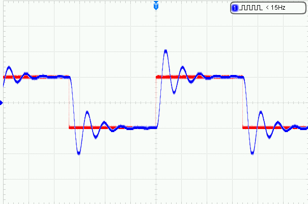

# Block-Diagram-Compiler
A simple text-based Block Diagram Compiler for Continuous System Simulation.
Learn to program an Analog Computer using this digital simulator.
Can run real-time simulations with ADC inputs and DAC outputs.

Coding requires simple three letter block functions followed by variable names

adc ch0 out

prt out

end

set ch0 0

set dt 0.01

run

The above example will read ADC0 every 10ms and print the result

An optional circuit board can be made using a CNC mill. Drill and profile
files are included for a 100mmx70mm board. The board enables
+-10V analog signals.

A serial terminal is required to enter and receive text data. 
Use simpleCRT.exe if you don't have a terminal program. 
simpleCRT can plot up to five variables.
